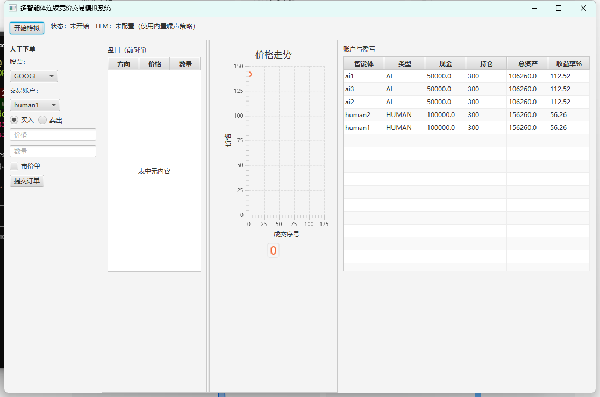
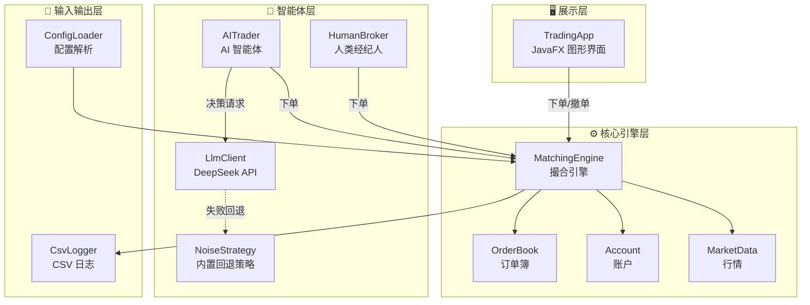

<div align="center">

# 📈 多智能体连续竞价股票交易模拟系统

**Multi-Agent Continuous Auction Stock Trading Simulation**

> 《Java 程序设计导论》课程项目 · 核心引擎 + JavaFX GUI + LLM 智能体

模拟真实证券交易所的**连续竞价**机制：多个交易智能体（人类 / AI）向撮合引擎提交委托，引擎按 **「价格优先、时间优先」** 撮合成交，观察**价格发现（Price Discovery）**的全过程——价格由订单碰撞产生，而非外部行情喂入。

[](https://adoptium.net)
[](https://maven.apache.org)
[](https://junit.org)
[](https://openjfx.io)
[](https://www.deepseek.com)

</div>

---

## 📑 目录

- [✨ 核心特性](#-核心特性)
- [🖼️ 界面预览](#-界面预览)
- [🧱 技术栈](#-技术栈)
- [🚀 快速开始](#-快速开始)
- [🧠 配置 LLM（可选）](#-配置-llm可选)
- [🏗️ 系统架构](#️-系统架构)
- [📁 项目结构](#-项目结构)
- [⚙️ 核心机制](#️-核心机制)
- [🧪 测试覆盖](#-测试覆盖)
- [📈 里程碑进度](#-里程碑进度)

---

## ✨ 核心特性

| 特性 | 说明 |
| --- | --- |
| 🔄 连续竞价撮合 | 「价格优先、时间优先」，支持限价单 / 市价单、部分成交、撤单 |
| 🤖 多智能体博弈 | 人类经纪人与 AI 智能体同时下单，AI 由大模型驱动决策 |
| 🧠 LLM 决策 | 接入 DeepSeek（OpenAI 兼容接口），调用失败自动回退内置策略 |
| 🖥️ 图形界面 | JavaFX 实时可视化：下单、深度图、持仓盈亏、价格走势 |
| 🛡️ 线程安全 | 撮合引擎与账户结算全同步，并发下单不丢失更新 |
| 🧪 完善测试 | JUnit 5 覆盖核心引擎、并发正确性、LLM 回退等 30 个用例 |

## 🖼️ 界面预览



## 🧱 技术栈

| 组件 | 说明 |
| --- | --- |
| **JDK** | Java SE 11+（本项目以 17 为目标版本） |
| **构建工具** | Maven |
| **测试** | JUnit 5 |
| **GUI** | JavaFX 21 |
| **LLM** | DeepSeek（OpenAI 兼容接口）+ 内置回退策略 |
| **JSON** | Jackson |

## 🚀 快速开始

```bash
# 编译 + 运行全部单元测试
mvn test

# 打包
mvn package

# 运行图形界面（下单、深度、盈亏、价格走势）
mvn javafx:run

# 运行控制台演示（观察价格发现全流程）
java -cp target/classes com.cufe.cs.trading.TradingDemo
```

运行后成交与委托日志写入 `logs/` 目录（`orders.csv`、`trades.csv`）。

## 🧠 配置 LLM（可选）

AI 智能体默认使用**内置噪声策略**；如需真实 LLM 决策，设置环境变量后再启动：

```bash
# Git Bash
export LLM_API_KEY=sk-xxxxxxxx
mvn javafx:run

# Windows cmd
set LLM_API_KEY=sk-xxxxxxxx
mvn javafx:run
```

> 💡 未设置 `LLM_API_KEY` 或 API 调用失败时，自动回退到内置策略，仿真照常运行。

> ⚠️ Windows `cmd` 下若控制台中文乱码，先执行 `chcp 65001` 切换为 UTF-8 代码页；Git Bash / IntelliJ / VS Code 等 UTF-8 终端无需处理。

## 🏗️ 系统架构



## 📁 项目结构

```
src/main/java/com/cufe/cs/trading/
├── model/                领域模型
│   ├── Side.java         买卖方向（BUY / SELL）
│   ├── OrderType.java    订单类型（LIMIT / MARKET）
│   ├── OrderStatus.java  订单状态（NEW / PARTIALLY_FILLED / FILLED / CANCELLED / REJECTED）
│   ├── Order.java        订单（含未成交量 remaining、时间优先序号）
│   ├── Trade.java        成交记录
│   └── PriceLevel.java   订单簿价格档位（深度图用）
├── core/                 核心引擎
│   ├── OrderBook.java       单一股票的买卖两个优先队列
│   ├── MatchingEngine.java  撮合引擎（submitOrder / cancelOrder 同步，线程安全）
│   ├── Account.java         账户（现金 + 持仓，预留/结算机制）
│   ├── AccountManager.java  账户注册表
│   ├── MarketData.java      行情（最新价、成交量、价格历史）
│   ├── Money.java           金额四舍五入工具
│   ├── MarketListener.java  市场事件监听接口
│   └── OrderRejectedException / InsufficientFundsException / InsufficientSharesException
├── agent/                交易智能体
│   ├── TradingAgent.java   智能体基类
│   ├── HumanBroker.java    人类经纪人（GUI 手工下单）
│   ├── AITrader.java       AI 智能体（LLM 决策线程 + 回退）
│   ├── Decision.java       一次交易决策
│   ├── MarketContext.java  决策所需行情/账户快照
│   ├── Strategy.java       策略接口
│   └── NoiseStrategy.java  内置噪声回退策略
├── llm/
│   └── LlmClient.java    LLM API 客户端（限流 / 超时 / JSON 解析 / 回退）
├── simulation/
│   └── Simulation.java   仿真编排（账户/智能体创建、启停 AI 线程）
├── ui/
│   └── TradingApp.java   JavaFX 图形界面
└── io/
    ├── ConfigLoader.java   读取 config.properties
    └── CsvLogger.java      CSV 日志
```

## ⚙️ 核心机制

### 📖 订单簿（OrderBook）

- **买单（bids）**：价格**降序**，同价先到者（序号小）优先
- **卖单（asks）**：价格**升序**，同价先到者（序号小）优先
- 采用两个 `PriorityQueue` 实现，复杂度 **O(log n)**

### 🤝 撮合算法（MatchingEngine）

1. 校验参数，并**预留**资金/持仓（限价买单冻结 `限价 × 数量` 现金、卖单冻结持仓）
2. 取对手队列，循环撮合：可成交（买价 ≥ 卖价）时**以对手（挂单）价格**成交
3. 逐笔结算双方账户，生成成交记录，移除已成交订单
4. 限价单剩余部分挂入订单簿；市价单剩余部分丢弃
5. 广播市场事件（日志 / GUI）

### 💰 账户结算（Account）

- `总资产 = 现金 + Σ(持仓 × 现价)`
- `收益率 = (总资产 − 初始资金) / 初始资金`
- 采用「预留」机制防止同一资金/持仓被重复下单，撤单/成交时退回

### 🛡️ 线程安全

- `MatchingEngine.submitOrder()` / `cancelOrder()` 均 `synchronized`
- `Account` 所有结算方法 `synchronized`
- 并发下单不丢失更新（见 `MatchingEngineTest.concurrentOrdersDoNotLoseUpdates`）

### 🧠 AI 智能体（AITrader + LlmClient）

- 每个 AI 智能体独立线程，按 `agent.ai.decision.interval` 秒间隔决策
- 读取行情/账户快照 → 构造提示词 → 调用 LLM（限流 1 次/秒、超时 20s）
- LLM 返回 `{"action":"BUY|SELL|HOLD","price":..,"quantity":..}`，经 Jackson 解析
- **安全约束**：报价限制在最新价 ±`llm.price.bound.pct`%，数量封顶 100 股，买卖前校验资金/持仓
- 无 API Key 或调用失败 → 回退到 `NoiseStrategy`（最新价附近随机挂单）

## 🔧 配置

配置文件位于 `src/main/resources/config.properties`：

```properties
simulation.speed=1.0            # 仿真速度倍数
simulation.duration=300         # 持续时间（秒）
stocks=AAPL,GOOGL,TSLA          # 股票列表
AAPL=175.50                     # 初始价格
agent.human.count=2             # 人类经纪人数量
agent.human.initial.balance=100000.00
agent.ai.count=3                # AI 智能体数量
agent.ai.initial.balance=50000.00
agent.ai.decision.interval=3    # AI 决策间隔（秒）
agent.initial.shares=100        # 每只股票初始持仓（提供卖盘流动性）
llm.endpoint=https://api.deepseek.com/v1/chat/completions
llm.model=deepseek-chat
llm.rate.limit.ms=1000          # LLM 限流
llm.price.bound.pct=5           # 报价安全区间
llm.api.key=${LLM_API_KEY}      # 从环境变量读取，缺省走内置回退
```

## 🧪 测试覆盖

`mvn test` 共 **30 个用例**，覆盖：

> 订单簿价格/时间优先 · 限价撮合 · 部分成交 · 市价单扫单 · 价格-时间优先 · 撤单 · 资金/持仓不足拒绝 · 多 symbol 隔离 · 账户结算 · 配置解析 · 并发正确性 · LLM 客户端回退 · 噪声策略 · 仿真编排 · AI 智能体下单

## 📈 里程碑进度

- [x] **核心引擎** — MatchingEngine + 账户 + JUnit 测试
- [x] **图形界面** — JavaFX：下单、深度图、持仓/盈亏、价格走势
- [x] **LLM 智能体** — 真实 API + 内置回退策略
- [ ] **UML 设计文档 + 实验报告**

---

<div align="center">
  <sub>Made with ☕ Java &nbsp;·&nbsp; CUFE CS</sub>
</div>
